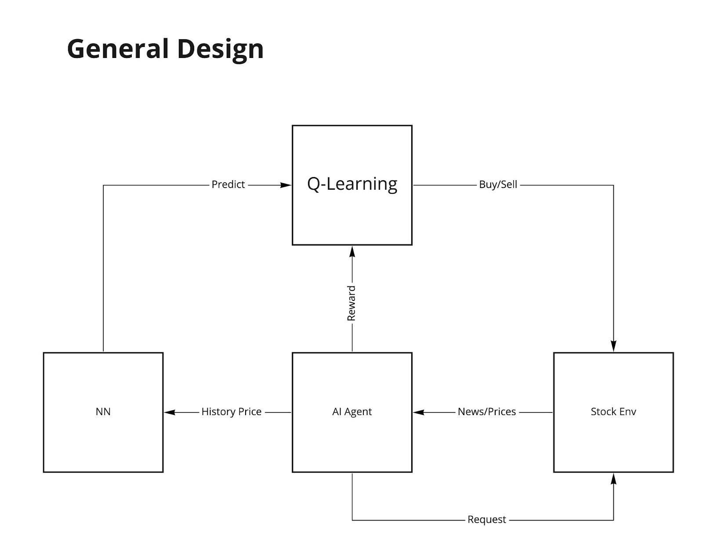
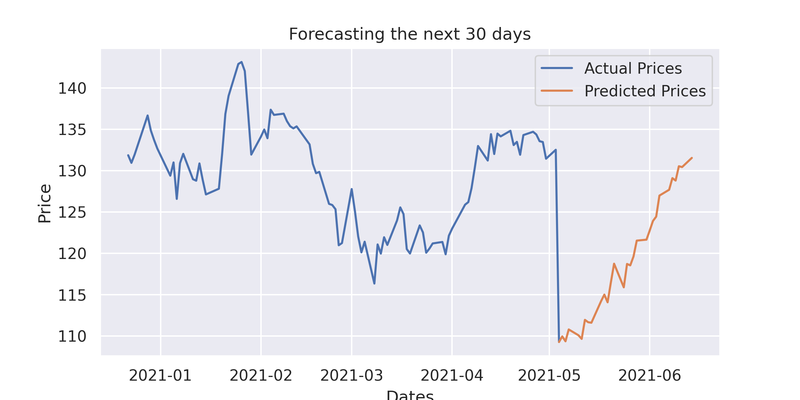
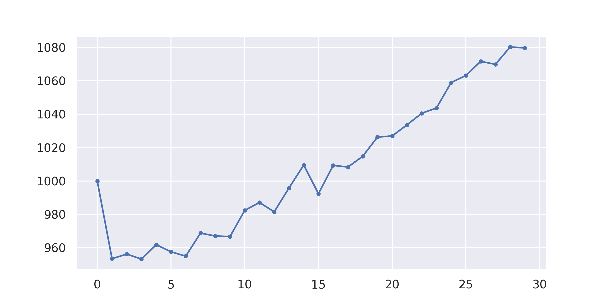

# AI & Cog Sci Final Project: Stock prediction & stock trading agent

#### Authors: Chengcheng Ding, Jacky Lin, Hanzheng Wang, Andrew Whitig

## What can it do?

Thank you for taking your interest into this project! In this project, you can achieve: price prediction of certain stocks by AI, simulate an market environment and have an AI agent do stock operations to see how they perform!

## Introduction

#### The Why (Motivation) 

For long, researchers have been interested in finding ways for AI to predict stocks or do stock operations (see our report to find more details). Obviously, the applications of accurate stock price prediction are alluring. One can imagine putting one's feet up and running a program which successfully executes trades and accumulates massive wealth without lifting a finger. Unfortunately this fantasy is unlikely to ever become a reality. Stock prices are volatile and at times subjective making them extremely difficult to predict. For this reason, a wide variety in approaches and perspectives have been taken in the pursuit of AI stock price prediction. In this project, we provide a neural network that predicts the price of a certain stock relatively precisely (0.1 huber loss after trained and tuned), and an AI agent that does stock trading moderately well.

#### The What (Technical aspect)

The project can be broken down into 2 generic parts: stock prediction with Neural Network (LSTM), and an agent designed to operate on a simulated stock market (currently only 1 stock) to achieve max profit.



If you are interested in our source code, 3 folders that are worth looking into are : 
1. [price_pred/](price_pred/), which focuses on using neural network to predict future prices. Especially the [nn.py](price_pred/nn.py), which contains the most important class that deals with price prediction NN. Here’s a graph of its result:



2. [stock_env/](stock_env/), which is mainly for creating a stock market environment for the q-learning agent. Especially the [custom_env.py](stock_env/custom_env.py), which defines a stock trading environment that works with the gym api.

3. [agent/](agent/), which deals with creating a q-learning agent to operate on the existing environment and try to achieve max profit. Especially the [QLAgent.py](agent/QLAgent.py), which is the main class that use the gym api to utilize reinforcement learning for operating and profiting in the designed stock environment. Here’s a graph of the result achieved by the agent.



Other folders includes:

* [data/](data/) which contains real historical prices downloaded from [Yahoo Finance](https://finance.yahoo.com/).
* [demo/](demo/) that includes demonstration of how our models work seperately written in `.ipynb` files. 
* [docs/](docs/) including [reports](docs/reports.pdf) and [user manual](UserManual.pdf)
* [example_out](example_out/) containing output files when you run `main.py`
* [pretrained_models](pretrained_models) having our pretrained LSTM/DRNN/Q-Learning Model


## How to use the program:
Finally! The exciting part! You can run the program by yourself by simply doing:

```bash
python main.py [-path] [-model] [-load] [-oname] [-save_model]
```

Options chart:
|  option | description | 
|  -- |  -- | 
|`-path`| Directory path of stock data, default is the provided `AAPL.csv`|
|`-model`|Type of NN model can be chosen from `lstm` or `drnn`. Default is `lstm`.|
|`-load`|`0` or `1`, if load saved model or train a new model. Default is `0`.|
|`-oname`|Name for saved files, any string is legal|
|`-save_model` |`0` or `1`, if save the newly trained model. Default is `0`.|

Of course ensure you have the most up-to-date version of the following python libraries or following the version: 

```
gym >= 0.18.0
numpy >= 1.19.1
pandas >= 1.1.4
tensorflow >= 2.3.0
seaborn >= 0.10.1
matplotlib >= 3.3.1
```

## Reference

1. [Yahoo Finance](https://finance.yahoo.com/)
2. [Github Repo - stocktradingrl](https://github.com/gustavovargas/stocktradingrl)
3. [Stock prediction nn article](https://link.springer.com/article/10.1007/s13042-019-01041-1#:~:text=Currently%2C%20there%20are%20many%20methods%20for%20stock%20price%20prediction.&text=The%20experiments%20show%20that%20the,prediction%20accuracy%20is%20over%2095%25)